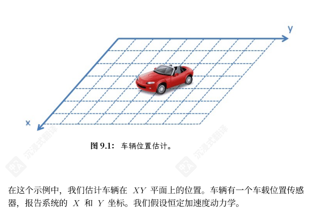
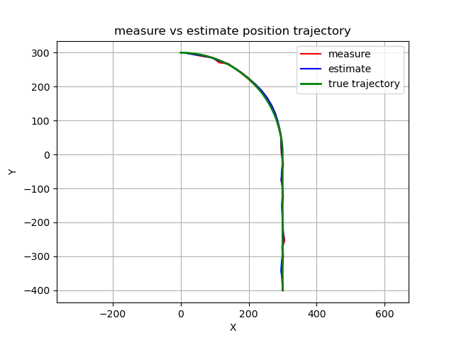
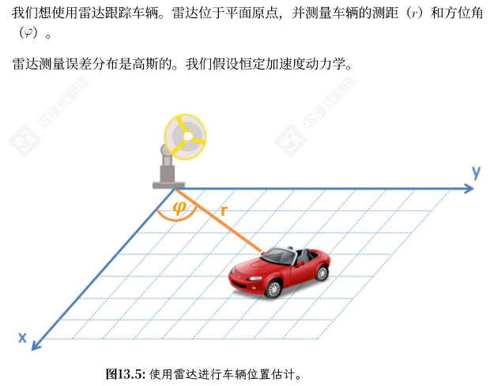
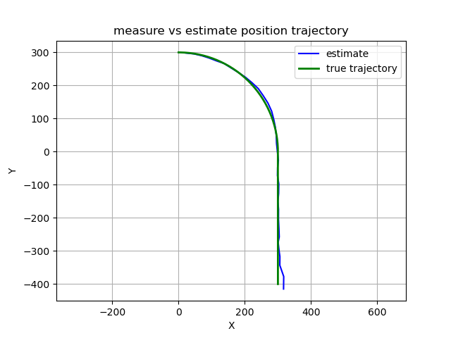
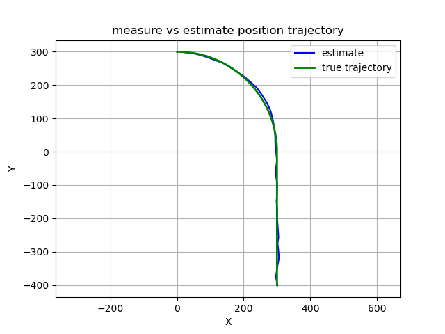

# Kalman Filter test
## Linear Kalman Filter
KF_position.py scene:

result:

## Extended Falman Filter
EKF_position.py scene:

result:

## Unsented Falman Filter
EKF_position.py scene:

result:

## Iterated Falman Filter
EKF_position.py scene:

result:
